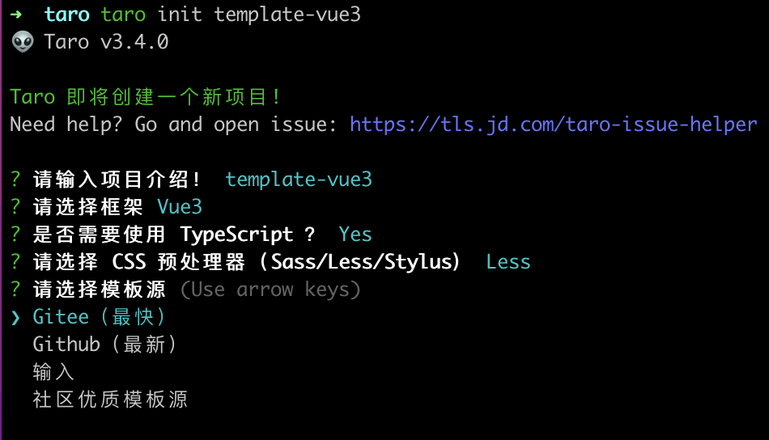

# 创建一个taro的项目

`taro`刚正式发布`3.4.x`版本，接下来我们将一起学习一下，如何使用`vue3 + pina + taro + typescript`实现开发跨端小程序。

## 安装

如果您之前已经安装过了taro，若不是`taro3.4.x`版本的请到全局的`node_modules`去删除并通过以下的步骤重新安装。

```shell

# 使用 npm 安装 CLI
$ npm install -g @tarojs/cli

# OR 使用 yarn 安装 CLI
$ yarn global add @tarojs/cli

```

:::warning 建议

官方也给出我们建议，如果在安装`sass`的时候报错了，需要我们配置一下`sass`的镜像

```shell
 npm install -g mirror-config-china
```
:::


## 创建项目

接下来我们需要使用`taro`创建一个项目：

```shell

taro init template-vue3

```

我们按照下面的步骤进行选择：



:::tip

`css`预处理器可以按照自己的喜好，我这里选用的是less

:::

最后拉取代码后，我们选择默认模板，等待安装即可。

## 配置`pinia`

首先我们安装一下`taro-plugin-pinia`插件来支持`pinia`

```shell
yarn add taro-plugin-pinia
```

在`config/index.js`中的`plugins`中增加插件`taro-plugin-pinia`

接下来我们安装`pinia`

```shell
yarn add pinia
```

安装完成后，我们在`src/app.ts`下配置加载一下`pinia`

```diff
import { createApp } from 'vue'
import './app.less'
+ import { createPinia } from "pinia"
const App = createApp({
  onShow () {},
  // 入口组件不需要实现 render 方法，即使实现了也会被 taro 所覆盖
})

+ App.use(createPinia());
export default App

```

## 编写`stores`

在`src/stores`目录下创建一个`user.ts`，我们用一个简单的例子来做演示


```ts
import { defineStore } from "pinia";

export const userStore = defineStore('user',{
  state:()=>({
    userId:null
  }),
  getters:{
    getUserId(state){
      return state.userId
    }
  },
  actions:{
    setUserId(){
      this.userId = 1;
    }
  }
})

```

我们在`src/pages/index/index.vue`中进行使用

```diff

<template>
  <view class="index">
+    <text>用户的id为：{{getUserId}}</text>
  </view>
</template>

<script lang="ts">
import { ref,defineComponent } from 'vue'
import './index.less'
+ import {userStore} from "../../stores/user";
+ import { storeToRefs } from "pinia"
export default defineComponent({
  setup () {
+    const store = userStore();
+    // 获取用户的id
+    const { getUserId } =storeToRefs(store);
+    // 设置用户的id
+    store.setUserId();
    const msg = ref('Hello world')
    return {
      msg,
+      getUserId
    }
  }
})
</script>
```

:::warning 注意：

由于在`pinia`中不能做解构（解构后会导致响应式失效），所以我们需要通过`pinia`官方提供的`storeToRefs`进行结构`state`和`getters`，但是不能解构`actions`。

:::

## 结束

到此为止我们就完成了一个`pinia + vue3 + typescript`的小程序开发的项目。[模板仓库](https://github.com/yanyu-fe/taro-vue3-template.git)

目前测试使用的小程序为微信小程序，兼容性测试未完善，欢迎提出意见和建议。
