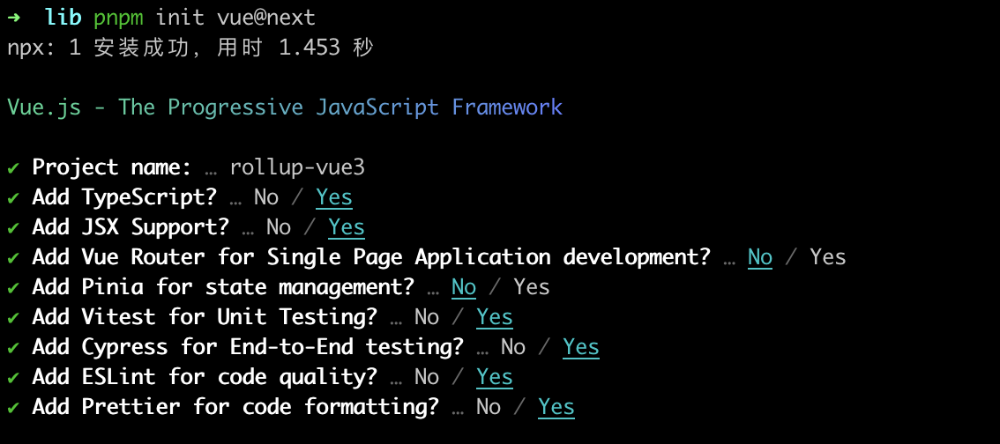

# 使用rollup打包vue3

本次我们使用`rollup`去打包`vue3`

## 准备阶段

1. 创建一个`vue3`的项目

```shell

pnpm init vue@next

```
选择项如下：




2. 进入项目安装依赖

```shell
# 进入目录
cd rollup-vue3
# 安装
pnpm i
# 安装rollup相关依赖
pnpm add rollup @rollup/plugin-node-resolve rollup-plugin-css-only rollup-plugin-esbuild rollup-plugin-typescript2 rollup-plugin-vue @vue/compiler-sfc esbuild  @types/bluebird ts-toolbelt -D
```

## 准备组件

我们先利用`src/components/HelloWord.vue`组件进行打包，我们`components`下创建一个`hello.ts`的`ts`文件，注册并导出我们的`HelloWord.vue`组件。

```ts

import HelloWord from "./HelloWorld.vue";
import type { App } from "vue";

export default {
  install(app: App) {
    app.component("HelloWord", HelloWord);
  },
};

export { HelloWord };

```

## 编写`rollup.config.ts`配置文件

> 在根目录下创建一个`rollup.config.ts`配置文件，添加如下的代码

```ts
import { defineConfig } from "rollup";
import nodeResolve from "@rollup/plugin-node-resolve";
// eslint-disable-next-line @typescript-eslint/ban-ts-comment
// @ts-ignore
import css from "rollup-plugin-css-only";
import esbuild from "rollup-plugin-esbuild";
import vue from "rollup-plugin-vue";

export default defineConfig({
    input: "src/components/hello.ts",
    external: ["vue"],
    plugins: [
        // 用来编译vue文件
        vue(),
        // 用来支持获取node_modules中的包
        nodeResolve(),
        // 打包vue文件中的css
        css({ output: "hello.css" }),
        // 处理ts
        esbuild({
            target: "esnext",
        }),
    ],
    output: [
        {
            file: "dist/hello.es.js",
            format: "esm",
        },
    ],
});

```

然后我们在`package.json`下配置打包命令

```json
{
  "scripts": {
    "build:rollup": "rollup -c rollup.config.ts",
  }
}
```

执行打包命令：

```shell
pnpm build:rollup
```

> 我们发现在我们的根目录中生成了一个`dist`文件夹，包含了我们配置的`css`和`js`文件，证明打包成功


## 配置`jsx`

这里我们需要使用`babel`和`rollup-plugin-vue`进行编译`tsx`。

```shell

pnpm add @rollup/plugin-babel @babel/core @babel/plugin-transform-runtime @vue/babel-plugin-jsx @babel/preset-env -D
 
pnpm add @babel/runtime

```

配置`rollup.config.ts`文件。

```ts

import { defineConfig } from "rollup"
import vue from "rollup-plugin-vue";
import css from "rollup-plugin-css-only";
import nodeResolve from "@rollup/plugin-node-resolve";
import babel from "@rollup/plugin-babel";
import { DEFAULT_EXTENSIONS } from "@babel/core";
import esbuild from "rollup-plugin-esbuild"


export default defineConfig({
    input:"src/index.ts",
    // 由于需要安装babel-runtime的环境，所以我们需要移除一下babel的运行时的环境
    external: ["vue", /@babel\/runtime/],
    output:[
        {
            format:"esm",
            file:"dist/index.js"
        }
    ],
    plugins:[
        vue(),
        nodeResolve(),
        css(),
        esbuild({
            target: "esnext",
            jsx: "preserve",
        }),
        babel({
            babelHelpers: "runtime",
            extensions: [...DEFAULT_EXTENSIONS, ".vue", ".ts", ".tsx"],
            presets: [
                [
                    "@babel/preset-env",
                    {
                        modules: false,
                    },
                ],
            ],
            plugins: ["@vue/babel-plugin-jsx", "@babel/plugin-transform-runtime"],
        }),
    ]
})

```


## 配置`typescript`生成`d.ts`

我们在使用其他组件库的时候发现都会有友好的代码提示，其中最主要的就是`ts`的类型处理的，所以我们还需要使用`ts`插件生成`d.ts`文件。

在`rollup.config.ts`中添加如下的插件和配置信息
```ts

```
