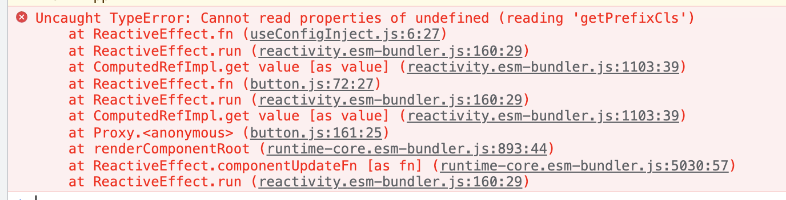

# 本地link自定义UI库报错

我们在开发完成一个UI组件库的时候，除了在`example`中去测试，我们还需要新建项目测试项目闭环，所以我们需要通过：

```shell

npm link 本地地址

yarn add file:本地地址

pnpm add 本地地址

```

这种方式去实现本地调试打包项目，但是我们有时候会发现项目报错的情况如下：



## 导致原因

罪魁祸首有可能是因为使用的`vue`的版本不一致造成的。所以我们需要调整两个环境使用相同的`vue`环境。

### 第一种方式

比较简单，我们可以发布到`npm`或者私有库中进行调试，报错不会再出现。

### 第二种方式

我们需要调整两个库的`vue`版本号一致：

我们在测试库中去引用`UI`库中的`vue`包环境：

```shell

npm link ui库环境中的vue

yarn add file ui库环境中的vue

pnpm add ui库环境中的vue

```

举个栗子，我需要将UI库中的vue环境链接过来：

```shell

pnpm add ~Desktop/edu/lib/libtools/node_modules/.pnpm/vue@3.2.28/node_modules/vue

```

然后我们删除`node_modules`中的`.vite`，然后重启项目，你会发现本地的项目也可以正常跑起来了！
